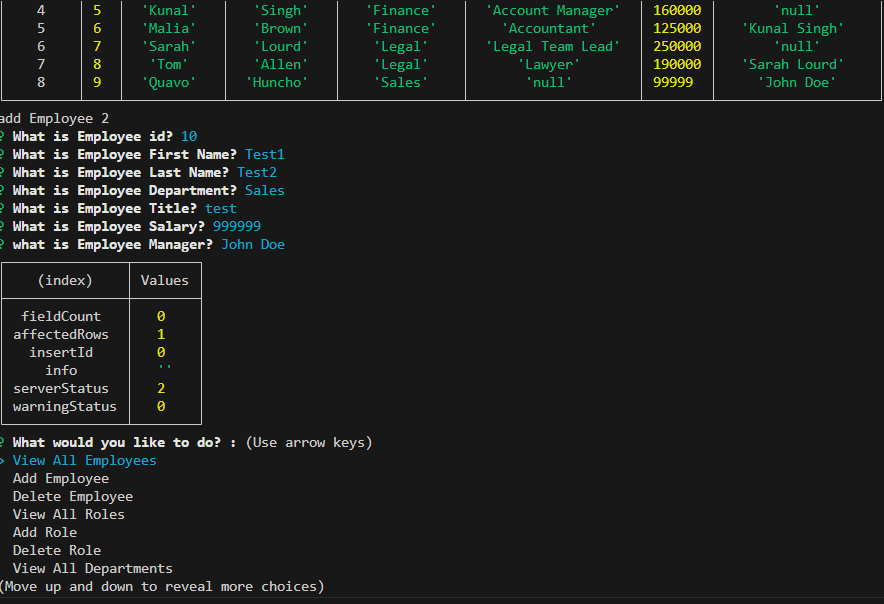

# Employee Manager

## Table of Contents

1.[Description](#Description) 
2.[Installation Instructions](#Installation-Instructions) 
3.[Usage Information](#Usage-Information) 
4.[Contribution Guidelines](#Contribution-Guidelines) 
5.[Test Instructions](#Test-Instructions) 
6.[License](#License) 
7.[Screenshots](#Screenshots) 
8.[Questions](#Questions) 
    ----> 1a.[GitHub User Name](#Github-User-Name) 
    ----> 2a.[Email](#Email) 
    ----> 3a.[Deployed Link](#Deployed-Link) 

## Description 

This is a template for creating an Employee Manager, it has a list of options to choose from displaying all employees, displaying all roles, displaying all departments, inserting, deleting to each table, viewing all employees by manager or department and lastly viewing the budget of each department. All data is accessible on mysql and prompt is provided by the package inquirer.

## Installation Instructions

User will be required to have node.js and packages inquirer@8.2.4 and mysql12 and express.

## Usage Information

For those who would like to have an Employee Manager application to practice and learn with.

## Contribution Guidelines

This is a solo mission.

## Test Instructions

If you find any bugs go ahead and meet me at the corner of here and there and send smoke signals after rubbing two hurricane tall cans together and I will appear from a portal.

## License

MIT License
(https://opensource.org/licenses/MIT)

## Screenshots

## Video Link

https://youtu.be/3Nuc0GN-nHs

## Questions

### Github User Name

algorithmnblues92

### Email

algorithmnblues92@gmail.com

 